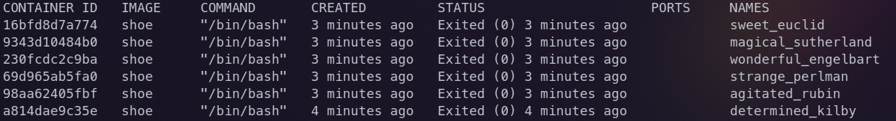
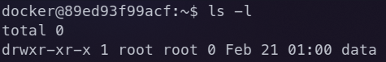
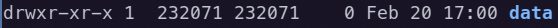

# Shoe-Expert Development Guide

## Cleaning Up Your Docker Environment

If you have already built an image using the Dockerfile and created a container before this guide has been written, then it will be much easier going forward if you delete any previously created containers.

### Removing Old Containers

To check for unneeded containers run the following command:

```bash
docker ps -a
```

You could see output like the following:



Essentially, any container where the `IMAGE` is tagged shoe is unneeded and you can run the next command to delete these containers:

```bash
docker rm $(docker ps -a | grep shoe | awk '{print $1}')
```

If you get warnings about unstopped containers, run:

```bash
docker stop $(docker ps -a | grep shoe | awk '{print $1}')
```

and then run the previous command again

### Removing Old Images

Old images should not be as much of a problem as those can be easily updated. This guide assumes that you will use the tag `shoe` when building images, so as not to cause confusion, you may want to remove any images for this repository with different tags if you have them.

You can list images with:

```bash
docker images
```

You can remove images by:

```bash
docker rmi IMAGE
```

where `IMAGE` could be an image tag (listed as repository in `docker images` output) or image id

## Building the Docker Image

### Installing Docker Buildx

#### Windows & macOS Users

- [Docker Buildx is included in Docker Desktop](https://github.com/docker/buildx#windows-and-macos)

#### Linux Users

##### Redhat & Debian based distros

- [Docker Buildx is included when installing `.deb` or `.rpm` packages managed by your package manager](https://github.com/docker/buildx#linux-packages)

##### Arch based distros

- In addition to the docker package, arch-based distros require the [docker-buildx](https://archlinux.org/packages/community/x86_64/docker-buildx/) package as well.

#### (All Users) Change default builder

- Set `buildx` as the [default builder](https://github.com/docker/buildx#set-buildx-as-the-default-builder) before building this repo's image by running `docker buildx install`.

### Creating the Image

In the root of the repository, run:

```bash
docker build -t shoe .
```

This will use the Dockerfile to build an image tagged as `shoe`.

## Creating the Container

In this step it is important to be in the root of the repo. Otherwise, the mounted directory will become misplaced on your native host. On my system, I've cloned the repo to `/home/mkapral/GitHub/Shoe-Expert`, but yours will be different. I recommend creating an environment variable and adding this to your shell's rc file for convenience.

```bash
cd /path/to/repo/root # change the path to your clone's root
echo "export SHOE_ROOT=$(pwd)" >> ~/.bashrc # replace with shell's rc file (e.g. ~/.zshrc for zsh)
source ~/.bashrc # replace with shell's rc file (e.g. ~/.zshrc for zsh)
```

Next, you can create the container with:

```bash
docker run -dit \
--name shoe-container \
-v ${SHOE_ROOT}/data:/home/docker/data \
shoe
```

or as a one-liner:

```bash
docker run -dit --name shoe-container -v ${SHOE_ROOT}/data:/home/docker/data shoe
```

*Only the contents within the `data` directory is shared between your native host and the container.*

## Entering the Container

So far, the container is running, but in detached mode in the background.

To use it you need to exec into like so:

```bash
docker exec -it shoe-container /bin/bash
```
## Taking Ownership of `data` Directory (Only If Necessary)

On some systems, it may be the case that the `data` directory is locked to the root user only.



To change this, run (inside the container):

```bash
sudo chown -R docker:root data
```

This should only be necessary to execute once after creating container, not every time you `exec` into the container. On my macOS system, this was not necessary as permissions defaulted to `docker:docker`, and I assume that that will be the most common case. The reason for changing ownership to `docker:root` and not `docker:docker` if you experience this is because on your native host, the ownership id's will likely change to some garbage values:



By using `docker:root`, then at least you'll have access to the directory through group permissions when not inside the container:


In any case, it will easiest to only modify the contents of `data` when inside the container.

## Stopping & Starting the Container

The container will only be accessible through the `docker exec` interface when the container is up. You can check the status of the container using `docker ps -a`. When not using the container, it may be desirable to stop it so that it won't use your computer's resources. To do this run:

```bash
docker stop shoe-container
```

Now, the container is not accessible. You will need to start it back up before the `docker exec` command will function properly.

```bash
docker start shoe-container
```

## Rebuilding the Container (Quick Reference)

Any modifications to the `Dockerfile` or `requirements.txt` file will require a rebuild of the `shoe` image and, consequently, your container will need to be recreated.

If this is the case, stop and remove your container:

```bash
docker stop shoe-container && docker rm shoe-container
```

Update the shoe image:

```bash
docker build -t shoe ${SHOE_ROOT}
```

Create the container:

```bash
docker run -dit --name shoe-container -v ${SHOE_ROOT}/data:/home/docker/data shoe
```

Run the container:

```bash
docker exec -it shoe-container /bin/bash
```

If you previously needed to change ownership of `data` directory from your container, you will need to do so again at this point.

